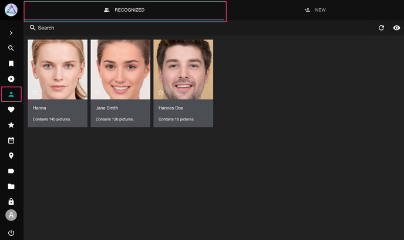
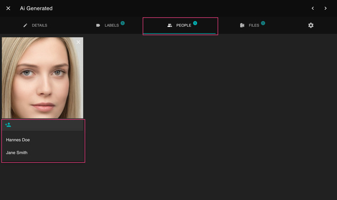
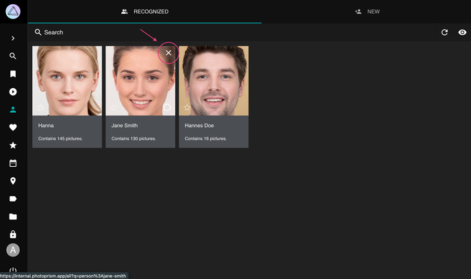
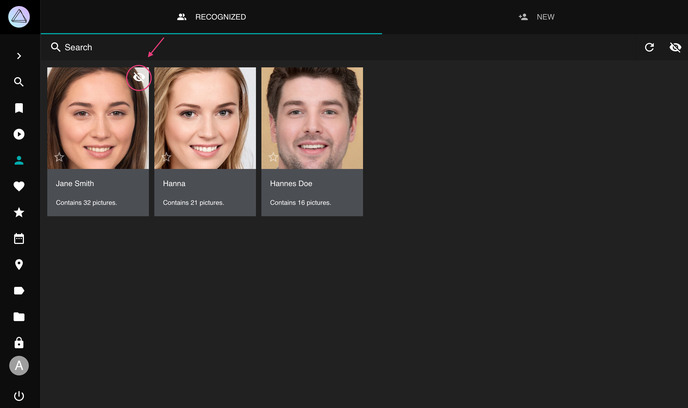
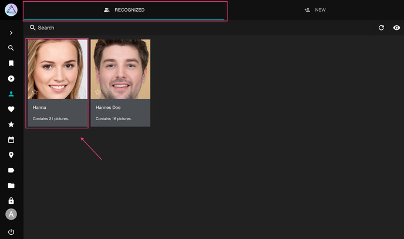
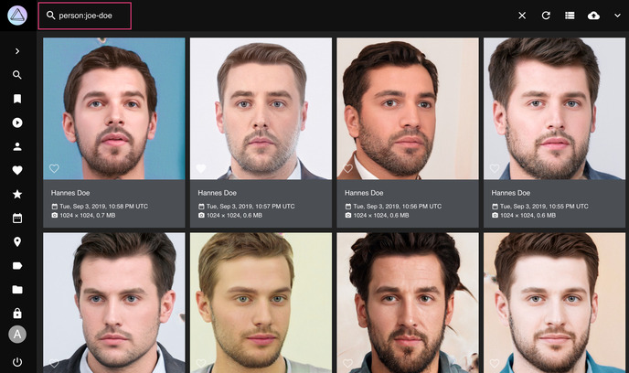
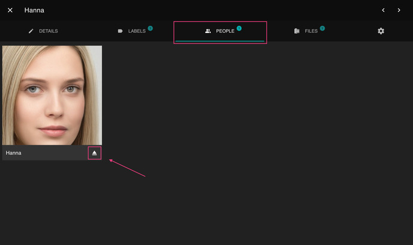
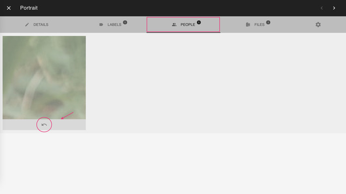
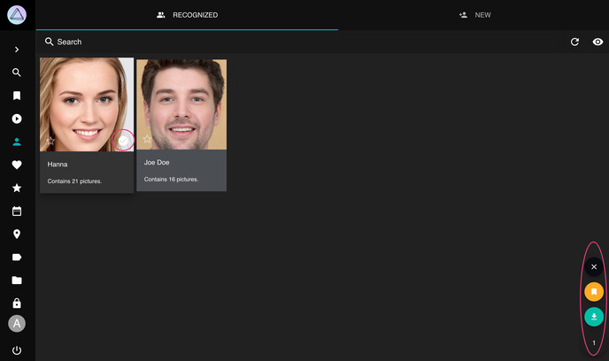

Unsere neueste Version beeinhaltet Gesichtserkennung. Sie ermöglicht dir, Bilder deiner Familie und Freunde zu finden.
Freue dich darauf, lang vergessene Bilder wieder zu entdecken! Wenn du deine Sammlung indexierst, werden Gesichter erkannt und nach
Ähnlichkeit gruppiert, so dass du sie schnell Personen zuordnen kannst.

!!! tldr ""
    Die Erkennung beginnt erst, wenn deine Bibliothek vollständig indexiert wurde. Das Suchen und Aktualisieren von Gesichtern verursacht vorübergehend eine hohe CPU-Belastung und kann je nach Hardware und Anzahl der Bilder eine Weile dauern.

!!! tldr ""
    Vorhandene Cluster werden automatisch im Hintergrund optimiert , 
    z. B. wenn neue Gesichter identifiziert, Gesichter aus einem Cluster entfernt oder neue
    Dateien zur Bibliothek hinzugefügt werden.

## Personen ##
Der Bereich Personen zeigt dir bereits identifizierte Personen sowie neue Gesichts-Cluster.

Klicke :material-star:, um eine Person als Favorit zu markieren. Favoriten werden ganz oben angezeigt.

{ class="shadow" }
{ class="shadow" }

### Warum werdem im Bereich NEU nicht alle erkannten Gesichter angezeigt?

Im Bereich *NEU* werden nur erkannte Gesichts-Cluster angezeigt. In deiner Sammlung kann es noch tausende weitere, nicht gruppierte Gesichter, geben, wie z.B. Gesichter auf Shampooflaschen
oder im Fernsehen. 

Du kannst diese Bilder finden, indem du nach `face:new` suchst. Falls du bestimmte Bilder suchst, empfehlen wir die Suche mit anderen Filtern, wie `year` or `country`,
zu kombinieren. Im [Bearbeitungs-Dialog](edit.md) werden immer alle Gesichter angezeigt. Hier kannst du den Gesichtern Personen zuordnen.

### Wenn ein Gesicht nicht erkannt wurde... ###

Gesichter können aus mehreren Gründen nicht erkannt werden:

- Möglicherweise musst du warten, bis die Indexierung abgeschlossen ist, da die Gesichtserkennung erst danach beginnt
- Bei Bildstapeln, wird nur die Primärdatei nach Gesichtern durchsucht
- Gesichter können kleiner als die konfigurierte Mindestgröße sein
- Unsere Gesichtserkennung hat das Bild nicht gründlich genug gescannt
- Eine reduzierte Auflösung sowie Qualität von generierten [Vorschaubildern](../settings/advanced.md) führt zu schlechteren Gesichtserkennungs-Ergebnissen
- Der Kontrast spielt eine große Rolle, so dass ein helles Gesicht mit grauen Haaren auf einem grauen Hintergrund für unsere Gesichtserkennung weniger auffällig sein kann als für dich
- In sehr seltenen Fällen kann ein Gesicht mit unserer Black-List von falsch positiven Ergebnissen übereinstimmen

!!! info ""
    Die Gesichtserkennung vergleicht die Ähnlichkeit von Gesichtern. Der Ähnlichkeits-Treshold für ein Gesicht
    wird reduziert, wenn du ein Gesicht aus einem Cluster entfernst.

## Gesichter identifizieren ##
=== "Unter Personen"
     1. Gehe zu *Personen*
     2. Gehe zu *Neu*
     3. Klicke in das Eingabefeld
     4. Beginne einen Namen einzugeben
     5. Drücke *Enter*

    { class="shadow" }

=== " Im Bearbeitungs-Dialog"

     1. Öffne den [*Bearbeitungs-Dialog*](edit.md)
     2. Gehe zu *Personen*
     3. Klicke in das Eingabefeld
     4. Beginne einen Namen einzugeben
     5. Drücke *Enter*

    { class="shadow" }

Die Person wird nun unter *Erkannt* angezeigt

## Personen ausblenden ##
Du kannst Personen im Bereich *Erkannt* ausblenden, indem du :material-close: klickst.

!!! attention ""
    Bilder von ausgeblendeten Personen tauchen weiterhin in Suchergebnissen auf.

{ class="shadow" }

Um alle Personen, inklusive ausgeblendete, zu sehen klicke :material-eye:.

{ class="shadow" }

Ausgeblendete Personen werden wieder angezeigt, wenn du :material-eye-off: klickst.

{ class="shadow" }

## Gesichter ausblenden ##
Du kannst Gesichts-Cluster im Bereich *Neu* auf die gleiche Weise wie [Personen](#personen-ausblenden) ausblenden.

## Alle Bilder einer Person ansehen ##
=== "Unter Personen"
     1. Gehe zu *Personen*
     2. Gehe zu *Erkannt*
     3. Klicke auf eine Person

    { class="shadow" }

=== "Über die Suche"
     1. Gehe zu *Suche*
     2. Suche nach person:"jane-doe"

    { class="shadow" }

## Personen umbenennen ##

1. Gehe zu *Personen*
2. Gehe zu *Erkannt*
3. Klicke auf den Namen
4. Gib einen neuen Namen ein
5. Drücke *Enter*

{ class="shadow" }

{ class="shadow" }

## Gesicht einer anderen Person zuordnen ##
Wenn einem Gesicht die falsche Person zugeordnet ist, kannst du dies ändern.

!!!attention ""
    Jedes Mal, wenn du ein Gesicht aus einem Cluster aussortierst, werden die Gesichts-Cluster im Hintergrund aktualisiert.

1. Öffne den [*Bearbeitungs-Dialog*](edit.md)
2. Gehe zu *Personen*
3. Klicke :material-eject:
4. Nun kannst du einen neuen Namen eingeben, oder das Feld leer lassen

{ class="shadow" }

## Gesichter entfernen ##
Falls etwas Falsches als Gesicht erkannt wurde, oder dich ein Gesicht nicht interessiert, kannst du es entfernen.

1. Öffne den [*Bearbeitungs-Dialog*](edit.md)
2. Gehe zu *Personen*
3. Klicke :material-close:

{ class="shadow" }

Bevor die Seite neu geladen wird kannst du diese Aktion rückgängig machen.

{ class="shadow" }

## Alle Bilder einer Person herunterladen ##
1. Gehe zu *Personen*
2. Selektiere eine Person
3. Öffne das Kontext-Menü
4. Klicke :material-download:

## Album aus Personen erstellen ##
1. Gehe zu *Personen*
2. Selektiere eine Person
3. Öffne das Kontext-Menü
4. Klicke :material-bookmark:
5. Wähle ein existierendes Album oder gib einen neuen Albumnamen ein
6. Klicke auf *Hinzufügen*

{ class="shadow" }

## Suche ##
Du kannst Bilder von bestimmten Personen mit Hilfe der folgenden Suchanfragen finden

- `people`, `faces` oder `faces:true` findet alle Bilder mit Gesichtern
- `faces:false` findet alle Bilder ohne Gesichter
- `faces:3` findet alle Bilder mit mindestens 3 Personen
- `person:"John Doe"` oder `subject:"John Doe"` findet alle Bilder der Person John Doe
- `people:"John"` oder `subjects:"John"` findet alle Bilder von Personen, deren Namen John enthält

Der person/subject sowie der people/subjects Filter kann in Kombination mit & und | verwendet werden (siehe [Suche](search.md)). 
Suchfilter können auch kombiniert werden.

`person:"John Doe&Jane Doe" faces:3` findet alle Bilder auf denen John und Jane Doe und mindestens eine weitere Person abgebildet sind.

{ class="shadow" }

## Performance Tipps ##

### Background Worker ###

Die Gesichtserkennung wurde unter der Annahme entwickelt und getestet, dass der Background Worker alle 15 Minuten läuft, es sei denn, das Backend ist mit anderen Aufgaben wie der Indexierung beschäftigt. Sie wurde nicht mit viel längeren Intervallen getestet und ist dafür auch nicht ausgelegt.

Der Background Worker gruppiert neue Gesichter nach Ähnlichkeit, vergleicht Gesichter mit Clustern und optimiert bei Bedarf bestehende Cluster. Ohne diese Routineaufgaben wird die Anzahl der zu verarbeitenden Gesichter zu groß. Bei der ersten und nächsten Ausführung des Workers kann es dann zu einer starken Serverbelastung kommen, bis alle Gesichter, Gesichtscluster und zugehörigen Bilder aktualisiert wurden. Je länger du wartest, desto mehr CPU wird benötigt und desto länger dauert es.

### Ältere Hardware ###

Es ist ein [bekanntes Problem](https://docs.photoprism.app/getting-started/troubleshooting/performance/#legacy-hardware), dass die Benutzeroberfläche und Backend-Vorgänge, insbesondere die Gesichtserkennung, auf älterer Hardware aufgrund mangelnder Ressourcen langsam sein oder sogar abstürzen können. Wie die meisten Anwendungen hat auch PhotoPrism bestimmte Anforderungen und unser Entwicklungsprozess beinhaltet keine Tests auf nicht unterstützter oder ungewöhnlicher Hardware.