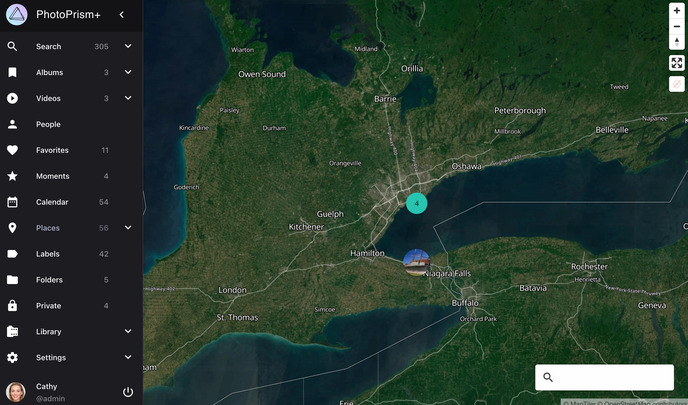

# Karten #
Im Bereich *Karten* werden alle mit GPS-Daten versehenen Bilder auf einer Weltkarte dargestellt.

Du kannst die Größe des Kartenausschnitts verändern, indem du entweder :material-plus: und :material-minus: verwendest oder 
auf einen der blauen Kreise (Bildkollektoren) klickst.

{ class="shadow" }
{ class="shadow" }

Wenn du nach etwas suchst, werden nur Bilder, die der Suche entsprechen angezeigt.

{ class="shadow" }

In den [Einstellungen](../settings/general.md) kannst du zwischen verschiedenen Kartenstilen auswählen.

!!! tip ""
    Um von der *Karteikarten Ansicht* im Bereich *Bilder* zu einem bestimmten Bild auf der Weltkarte zu wechseln, klicke auf den Aufnahmeort dieses Bilder.

   { class="shadow" }
   { class="shadow" }

## 3D Modus aktivieren

Die Karten "Satellit", "Outdoor" und "Topographisch" können auch in 3D betrachtet werden.

Um den 3D Modus zu aktivieren klicke auf :material-image-filter-hdr-outline:. Um die Perspektive zu ändern, kannst du die rechte Maustaste gedrückt halten und bewegen.

{ class="shadow" }