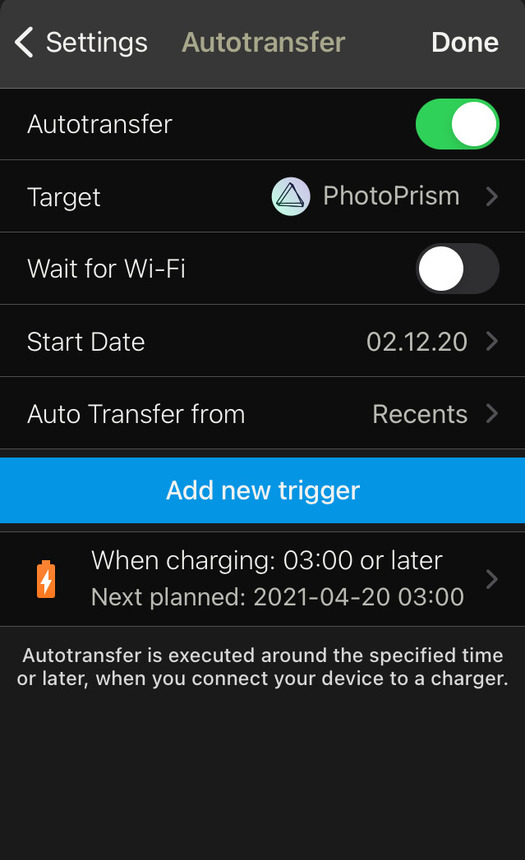

# Bilder von mobilen Endgeräten synchronisieren #
Um Bilder und Videos von deinem Handy mit PhotoPrism zu synchronisieren, kannst du jede App, die Datei-Synchronisation mit WebDAV unterstützt, verwenden.

!!! info ""
    WebDAV kann in den [Erweiterten Einstellungen](../settings/advanced.md) deaktiviert werden.
    Da der WebDAV-Server Schreibrechte und Authentifizierung erfordert, wird er automatisch deaktiviert, wenn du PhotoPrism im [public](https://docs.photoprism.app/getting-started/config-options/#authentication) und/oder [schreibgeschützten Modus](https://docs.photoprism.app/getting-started/config-options/#feature-flags) betreibst.

## PhotoSync ##
Wir empfehlen die, für iOS und Android verfügbare, App [PhotoSync](https://link.photoprism.app/photosync).

### Übertragungsziel einrichten ###

!!! attention ""
    Falls du PhotoSync auf Android nutzt, wähle WebDAV als Übertragungsziel. 

1. Öffne PhotoSync und klicke :material-cog-outline:
2. Klicke *Konfigurieren*
3. Wähle PhotoPrism als Übertragungsziel

      {: style="width:35%" class="shadow"}
      {: style="width:35%" class="shadow"}
   
4. Trage deine PhotoPrism Konfiguration ein

    !!! info ""
        *Server:* Deine Server Url, z.B. "example.com".

        *Port:* Dein Port. Falls du HTTPS verwendest ist der Port 443.

        *Login:* Dein Benutzername, z.B. "admin".
        
        *Password:* Dein Admin Passwort.

        *Directory:* /import/ oder /originals/ jenachdem, wie du deine Dateien [einlesen möchtest](../library/import-vs-index.md).
        
        *Use SSL:* Sollte aktiviert sein.

        [PikaPods](https://docs.photoprism.app/getting-started/cloud/pikapods/) Benutzer können [hier](https://docs.pikapods.com/apps/photoprism/#sync-from-mobile-apps) weitere Informationen finden. 

      {: style="width:35%" class="shadow"}

5. Klicke *Fertig*
6. Du kannst die Übertragungsdetails deinen Wünschen anpassen
   
      {: style="width:35%" class="shadow"}
      {: style="width:35%" class="shadow"}
   
### Automatische Synchronisation einrichten ###
1. Öffne PhotoSync und klicke :material-cog-outline:
2. Klicke *Autotransfer*

      {: style="width:35%" class="shadow"}

3. Klicke *Neuer Auslöser* und wähle mindestens einen Auslöser
   
      {: style="width:35%" class="shadow"}
   
4. Wähle PhotoPrism als Übertragungsziel
5. Klicke *Fertig*

      {: style="width:35%" class="shadow"}

PhotoPrism startet den Import- bzw. Indexiervorgang automatisch, nachdem neue Dateien mit PhotoSync übertragen wurden.

## Andere Apps ##
Wenn du PhotoPrism auf einem Gerät ausführst, das Samba (Windows File Sharing) unterstützt, kannst du auch diese kostenlose open source Android App verwenden:
[SMBSync2 - Github](https://github.com/Sentaroh/SMBSync2/releases) | [SMBSync2 - Google Play](https://play.google.com/store/apps/details?id=com.sentaroh.android.SMBSync2)
