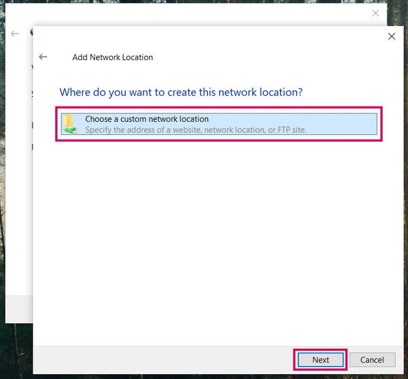
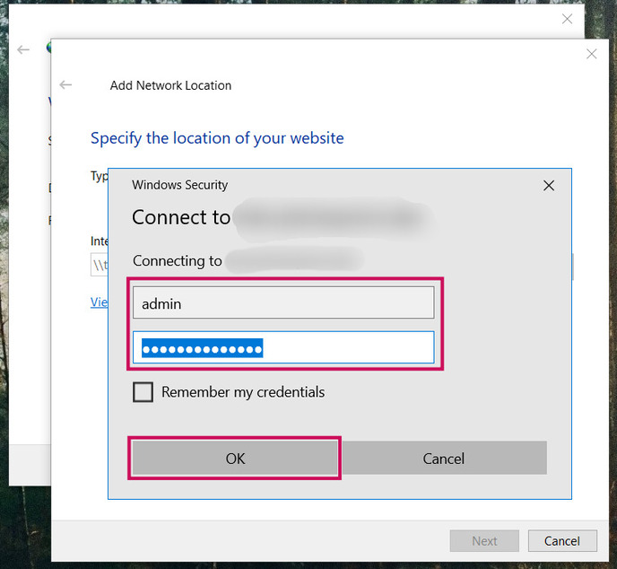

# Verbindung via WebDAV #

WebDAV-kompatible Apps und Clients wie [PhotoSync](./sync-phone.md), der Windows Explorer von Microsoft oder der Finder von Apple, können sich direkt mit PhotoPrism verbinden.

Dazu wird der *Originals* oder *Import* Ordner als Netzwerklaufwerk verbunden, so kannst du Dateien von deinem Computer oder Smartphone aus öffnen, bearbeiten oder löschen.

Sobald alle Dateien hinzugefügt sind, können sie [importiert oder indexiert](../library/import-vs-index.md) werden.
Nachdem Dateien über WebDAV hochgeladen wurden, beginnt die Indexierung nach einer kurzen Verzögerung.

Es ist auch möglich, Dateien mit [externen WebDAV-Servern](../settings/sync.md) wie ownCloud oder anderen PhotoPrism-Instanzen zu synchronisieren.


!!! info ""
	WebDAV kann in den [Erweiterten Einstellungen](../settings/advanced.md) deaktiviert werden.
	Wenn du PhotoPrism im [public-Modus](https://docs.photoprism.app/getting-started/config-options/) ohne Authentifizierung betreibst, ist WebDAV aus Sicherheitsgründen automatisch deaktiviert.

!!! danger ""
	Verwende WebDAV nicht [ohne HTTPS](https://docs.photoprism.app/getting-started/using-https/) außerhalb deines lokalen, privaten Netzwerks, da dein Passwort im Klartext über das Internet übertragen werden würde. Backup-Tools und Apps zur Dateisynchronisation wie [FolderSync](https://foldersync.io/docs/faq/#https-connection-errors) können die Verbindung ebenfalls verweigern.


## Server Url ##
Wenn die Instanz mit dem öffentlichen Internet verbunden ist, hat die WebDAV-URL des *Originals*-Ordners das folgende Format, wobei `example.com` durch den tatsächlichen Hostnamen und `admin` durch den [tatsächlichen Benutzernamen](#zugangsdaten) ersetzt werden muss:

```
https://admin@example.com/originals/
```

Für Benutzer, die eine lokale Instanz auf dem Standardport 2342 *ohne HTTPS* betreiben, lautet die URL des *Originals*-Ordners wie folgt (der Standardbenutzername für neue Instanzen ist `admin`, es sei denn, du hast ihn in der Konfiguration [geändert](https://docs.photoprism.app/getting-started/config-options/#authentication):

```
http://admin@localhost:2342/originals/
```

Beachte, dass der Slash am Ende des Pfades nicht weggelassen werden darf und dass die WebDAV URL in deinen Client-Anwendungen aktualisiert werden muss, wenn sich der Hostname oder der Port des Servers ändert.

!!! note ""
	Du kannst die URL des *Originals*-Ordners einsehen, indem du zu [Einstellungen > Konto](../settings/account.md) navigierst und dann auf *Mit WebDAV Verbinden* klickst. Es ist möglich, sich alternativ mit dem *Import*-Ordner zu verbinden, indem du in der URL `/originals/` durch `/import/` ersetzst.


### Microsoft Windows

Unter Windows musst du einen [Ressourcenstring in folgendem Format eingeben](#mit-webdav-verbinden), um den WebDAV-Zugang zu [konfigurieren](https://docs.photoprism.app/getting-started/troubleshooting/windows/#connecting-via-webdav), wobei „example.com“ durch den tatsächlichen Hostnamen deiner Instanz ersetzt werden muss:

```
\\example.com@SSL\originals\
```

Wenn dein Server nicht den Standard-Port 443 für [HTTPS](https://docs.photoprism.app/getting-started/using-https/) verwendet, kannst du unter Windows direkt nach `@SSL` einen benutzerdefinierten Port wie 8443 angeben:

```
\\example.com@SSL@8443\originals\
```

Bei lokalen Installationen, die auf dem Standard-Port 2342 *ohne HTTPS* laufen, trage die folgende Ressource in den [Verbindungsdialog](#mit-webdav-verbinden) ein (eventuell musst du dafür die [Registry Einstellungen](https://docs.photoprism.app/getting-started/troubleshooting/windows/#connecting-via-webdav) aktualisieren):

```
\\localhost:2342\originals\
```

Bitte beachte, dass der Slash am Ende nicht weggelassen werden darf und dass die WebDAV-Ressource in Windows aktualisiert werden muss, wenn sich der Hostname oder Port des Servers ändert.

!!! note ""
	Du kannst die URL des *Originals*-Ordners einsehen, indem du zu [Einstellungen > Konto](../settings/account.md) navigierst und dann auf *Mit WebDAV Verbinden* klickst. Es ist möglich, sich alternativ mit dem *Import*-Ordner zu verbinden, indem du in der URL `/originals/` durch `/import/` ersetzst.

## Zugangsdaten

Um über WebDAV auf deine Instanz zuzugreifen, kannst du deinen Benutzernamen in Kombination mit deinem Kontopasswort oder [einem App-Passwort](../settings/account.md#apps-und-gerate) verwenden, falls du z.B. die [2-Faktor-Authentifizierung (2FA)](../users/2fa.md) für dein Konto aktiviert hast oder dich über [OpenID Connect (OIDC)](https://docs.photoprism.app/getting-started/advanced/openid-connect/) authentifizierst, da die Verwendung deines Kontopassworts in diesem Fall nicht möglich ist.

Wenn der Zugriff verweigert wird, obwohl die Anmeldedaten korrekt sind, überprüfe bitte, ob das Konto eine [Rolle mit WebDAV-Zugriff](../users/roles.md) hat und [WebDAV für dieses Konto aktiviert ist](../users/cli.md#optionen).

[Mehr erfahren ›](../users/index.md)

## Mit WebDAV verbinden

=== "macOS"

     1. Im **Finder** klicke "Gehe zu" > "Mit Server verbinden"
     2. Trage die Url in das Feld **Serveradresse** ein
     3. Klicke  **Verbinden**

	[Wenn du Probleme bei der Verbindung mit WebDav hast](https://docs.photoprism.app/getting-started/troubleshooting/windows/#connecting-via-webdav):

	- [ ] Du hast nicht genügend Benutzerrechte (versuche es als Admin)
  	- [ ] Es gibt ein [allgemeines Authentifizierungsproblem](https://docs.photoprism.app/getting-started/troubleshooting/#cannot-log-in)
  	- [ ] Deine Instanz oder dein Reverse Proxy verwendet ein ungültiges HTTPS-Zertifikat
  	- [ ] Du versuchst, dich mit dem falschen Netzwerk oder Server zu verbinden

=== "Windows 10"

     1. Öffne den **Windows Explorer**
     2. Klicke mit der rechten Maustaste auf **Mein PC**
     3. Wähle **Netzwerklaufwerk hinzufügen...**

		{ class="shadow" }

     4. Wähle den Laufwerksbuchstaben sowie das Verzeichnis, das mit WebDAV verknüpft werden soll
     5. Wähle die Optionen **Verbindung bei Anmeldung wiederherstellen** und **Verbindung mit anderen Anmeldeinformationen herstellen** aus
     6. Öffne folgenden Link: **Verbindung mit einer Webseite herstellen, auf der Sie Dokumente und Bilder speichern können**
    
		{ class="shadow" } 
		
	 7. Klicke  **Weiter**

		{ class="shadow" }

     8. Klicke **Eine benutzerdefinierte Netzwerkadresse auswählen** und dann auf **Weiter**
     
		{ class="shadow" }	
	
	 9. Trage die URL, wie oben beschrieben, in das Feld **Internet oder Netzwerkadresse** ein und klicke **Weiter**

		{ class="shadow" }

     10. Gib deinen Nutzernamen und dein Passwort ein und klicke **OK**
		
		{ class="shadow" }

	11. Gib einen Namen für die Netzwerkverbindung ein und klicke **Weiter**

		{ class="shadow" }

	10. Klicke **Fertig stellen**

		{ class="shadow" }

	Der *Originals* Ordner ist nun als Netzwerklaufwerk im Windows Explorer eingebunden und du kannst direkt Dateien oder Verzeichnisse hinzufügen, bearbeiten oder löschen.
	
	{ class="shadow" }

  	[Wenn du Probleme bei der Verbindung mit WebDav hast](https://docs.photoprism.app/getting-started/troubleshooting/windows/#connecting-via-webdav):

     - [ ] Möglicherweise musst du **[die grundlegende Authentifizierungsstufe](https://docs.photoprism.app/getting-started/troubleshooting/windows/#connecting-via-webdav)** in der Registrierung ändern
     - [ ] Du hast nicht genügend Benutzerrechte (versuche es als Admin)
     - [ ] Es gibt ein [allgemeines Authentifizierungsproblem](https://docs.photoprism.app/getting-started/troubleshooting/#cannot-log-in)
     - [ ] Deine Instanz oder dein Reverse Proxy verwendet ein ungültiges HTTPS-Zertifikat
     - [ ] Du versuchst, dich mit dem falschen Netzwerk oder Server zu verbinden