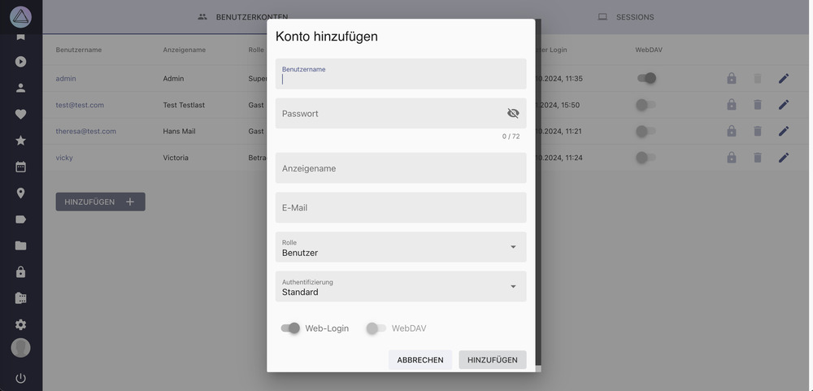
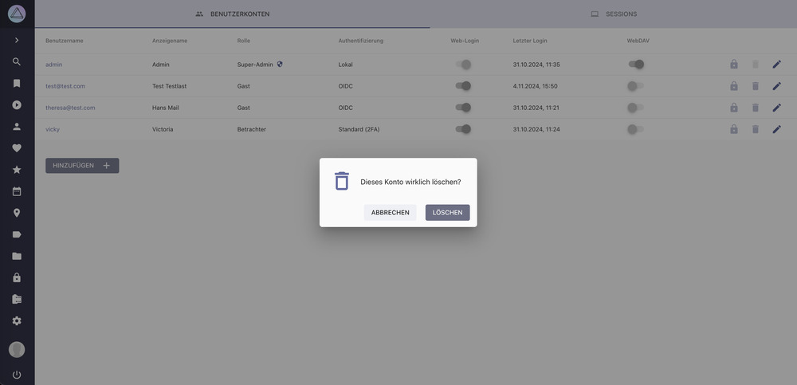

# Benutzer verwalten

!!! example ""
    Benutzer-Rollen und das Admin-Web-UI sind derzeit nur in [PhotoPrism® Plus](https://www.photoprism.app/editions#compare) verfügbar.

Du kannst Benutzerkonten hinzufügen, bearbeiten und löschen, indem du als [Admin](#admin) zu *Einstellungen > Benutzer* navigierst:

{ class="shadow" }

## Neuen Benutzer hinzufügen

{ class="shadow" }

## Benutzer Details bearbeiten

{ class="shadow" }

## Passwörter ändern

Super-Admins können das Passwort eines Nutzers zurücksetzen, während normale Admins Passwörter nur ändern können, wenn sie das aktuelle Passwort kennen.

{ class="shadow" }

## Benutzer löschen

{ class="shadow" }

## Rollen und Berechtigungen

| Role    |   View Library   |     Download     |      Upload      |  WebDAV  |   Full Access    |
|---------|:----------------:|:----------------:|:----------------:|:--------:|:----------------:|
| admin   | :material-check: | :material-check: | :material-check: | optional | :material-check: |
| user    | :material-check: | :material-check: | :material-check: | optional |                  | 
| viewer  |  except private  |  except private  |                  |          |                  |
| guest   |                  |      shared      |                  |          |                  |
| visitor |                  |      shared      |                  |          |                  |

### Admin

*Admins* haben uneingeschränkten Zugang zu allen Bildern, Alben und Einstellungen.

Reguläre *Admins* können ihre Privilegien durch einen absichtlichen oder versehentlichen Rollenwechsel verlieren. Konten mit dem optionalen "Superadmin"-Status (kann mit dem `-s`-Flag gesetzt werden) behalten jedoch ihre Admin-Privilegien, auch wenn ihnen eine Nicht-Admin- oder ungültige Rolle zugewiesen wird. Damit soll verhindert werden, dass sie sich selbst aussperren.

Wenn *Superadmins* Einstellungen wie die Sprache oder das Theme ändern, werden diese automatisch zu den Standardeinstellungen für andere Nutzer/innen, es sei denn, sie haben ausdrücklich eine andere Wahl getroffen. Außerdem können globale Funktionsflags nur von *Superadmins* geändert werden.

### Benutzer

*Benutzer* haben vollen Zugriff auf die Bibliothek und können alle Bilder und Alben ansehen, bearbeiten und löschen. Anders als *Admins* können *Benutzer* die [Bibliotheks-](../settings/library) und die [Erweiterten Einstellungen](../settings/advanced) nicht einsehen oder ändern, sondern nur persönliche Einstellungen wie Theme, Sprache und Passwort. Außerdem kann ihr WebDAV-Zugang deaktiviert werden. Zukünftige Versionen werden möglicherweise weitere Möglichkeiten bieten, die Benutzerrechte anzupassen, z. B. mit individuellen Kontoattributen.

### Betrachter

*Betrachter* sind den regulären *Benutzern* ähnlich, mit dem Unterschied, dass sie keinen Schreibzugriff auf die Bibliothek haben und keine Inhalte sehen können, die archiviert oder als privat markiert wurden. Sie können auch keine Dateien hochladen/importieren oder die Indexierung auslösen. Wie alle registrierten Nutzer können *Betrachter* persönliche Einstellungen wie Theme, Sprache und Passwort ändern und speichern.

### Gast

*Gäste* haben nur lesenden Zugriff, um die Ressourcen anzusehen und herunterzuladen, die andere Nutzer/innen für sie freigegeben haben. Sie können auch persönliche Einstellungen wie Theme, Sprache und Passwort ändern.

### Besucher

*Besucher* können nicht manuell hinzugefügt werden. Diese spezielle Rolle ist an ein Systemkonto gebunden, das anonyme Nutzer/innen repräsentiert, die Links verwenden, um Alben oder andere Inhalte anzusehen, die für sie freigegeben wurden. Besucher können nur auf diese Ressourcen zugreifen und sich nicht mit einem Benutzernamen oder Passwort anmelden. Anders als Gäste können sie auch ihre persönlichen Einstellungen nicht länger behalten, als ihre Browser-Sitzung andauert.

## Bilder mit Gästen teilen

Um Ressourcen für Gäste freizugeben, können Admins und Benutzer [Freigabelinks](../share/share.md) erstellen. Wenn ein/e Nutzer/in mit eingeschränkten Rechten einen solchen Link öffnet, während er/sie eingeloggt ist, erhält sein/ihr Konto Lesezugriff auf die freigegebenen Ressourcen. Später wird es auch möglich sein, Inhalte mit anderen Nutzern direkt über die Weboberfläche zu teilen, ohne vorher Links zu erstellen.